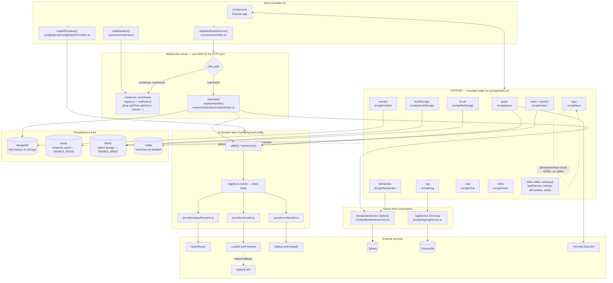
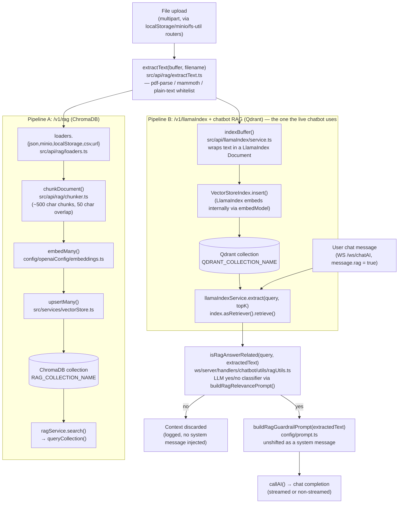

# Architecture

Graph-form reference for this repository. Diagrams reflect the code as of the `rag-system` branch (2026-09-27) — file paths and function names are taken directly from source, not invented.

## 1. System overview

**Reading it:** one Express `app` and one `WebSocketServer` share the same HTTP port (`src/index.ts`). REST features under `/v1/*` and the `/ws/chatAI` WebSocket path both call into the shared AI provider layer (`callAI`) rather than talking to OpenAI-compatible SDKs directly. `laya` is the one AI-ish feature that doesn't use `callAI` — it runs a local ONNX model via `@receptron/laya` in-process. There are two separate, non-overlapping vector-store pipelines (see diagram 2) — this is the fact most likely to trip up someone modifying RAG behavior in only one of them.

## 2. RAG ingestion & retrieval pipeline

**Reading it:** every file, regardless of which pipeline ingests it, goes through the same `extractText()` extension whitelist (plain text, `.json`/`.jsonl`/`.xml`/config/code formats, plus dedicated PDF and DOCX parsers). From there the two pipelines diverge completely — **Pipeline A** (`/v1/rag/*`) chunks text itself and stores vectors in ChromaDB; it's reachable only via its own REST endpoints and nothing else in the app calls it. **Pipeline B** (`/v1/llamaIndex/*`) lets LlamaIndex manage chunking/embedding internally and stores vectors in Qdrant; this is the pipeline the `/ws/chatAI` handler actually uses when a message sets `rag: true`. Before Pipeline B's retrieved context is ever shown to the model, `isRagAnswerRelated()` runs a cheap LLM classification of "is this context relevant to the query" — irrelevant matches are dropped instead of being injected, so a near-miss vector hit can't derail an unrelated answer.

## Known gaps / things not to assume

- The README.md at the repo root is stale (original `express-typescript-2024` boilerplate copy); it does not describe the RAG/chatbot/goals/laya features. Treat CLAUDE.md and this file as the current source of truth instead.
- Kafka (`config/kafka.ts`) is registered but its `initKafka()` call is commented out in `src/server.ts` — code exists, but it does not run.
- Whether Pipeline A (Chroma) is still actively maintained or is legacy from an earlier iteration of the RAG feature is not something the code states explicitly — it is simply unreferenced by the chatbot. Confirm with the project owner before removing it.
