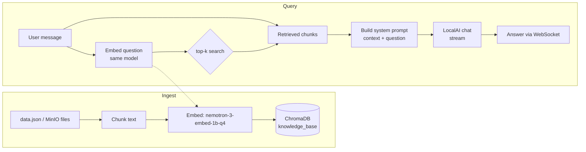
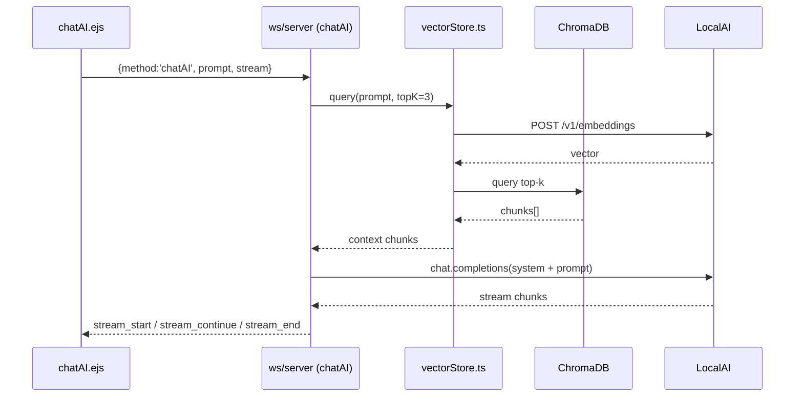

# RAG System — ChatAI (LocalAI + ChromaDB)

This document describes how to turn the standalone RAG prototype into a proper, integrated Retrieval-Augmented Generation system inside this app.

## 1. What this is

RAG = **Retrieve → Augment → Generate**.

The model is not trained on *your* data, so instead of asking it to hallucinate answers from memory, we:

1. **Retrieve** the most relevant text chunks from a vector database (exact-match/pinyin-free, embeddings based).
2. **Augment** the prompt by injecting those chunks as context.
3. **Generate** the answer conditioned on that context.

The existing `rag.js` script already proves each piece works standalone. This plan wires it into the running service so the WebSocket chat handler retrieves context automatically and exposes REST endpoints to manage the knowledge base.

## 2. Architecture

### Flow diagram



### Sequence diagram (chat handler call chain)



## 3. Components

| Component | Tech | Location |
|-----------|------|----------|
| LLM + embeddings | LocalAI (`http://localhost:8080`) | `src/openai/embeddings.ts` (new) |
| Vector database | ChromaDB (`http://localhost:8000`) | `src/services/vectorStore.ts` (new) |
| RAG REST API | Express + zod | `src/api/rag/` (new) |
| Chat integration | WebSocket handler | `src/ws/server/handlers/chatAI.ts` |
| Chat UI | EJS | `src/public/chatAI.ejs` |
| Legacy prototype | standalone script | `rag.js` (reference only) |

## 4. The flow (step by step)

### A. Ingest path

1. Load documents: `./data.json` (start), later MinIO-uploaded files.
2. Split text into chunks (one chunk per JSON entry, or robust `chunkText()` helper).
3. Embed each chunk with the **same** embedding model used for queries.
4. Store `{ id, embedding, text }` in ChromaDB collection `knowledge_base`.

### B. Query path

1. User sends a chat message over `/ws/chatAI`.
2. Embed the user's question (same model — critical).
3. Run a top-k similarity search in ChromaDB.
4. Build a `system` prompt containing the retrieved chunks + the question.
5. `chatAI.ts` sends `system` + conversation to LocalAI.
6. The streamed answer is pushed back over the WebSocket.

## 5. Files to create / modify

| # | Action | File | Purpose |
|---|--------|------|---------|
| 1 | modify | `src/common/utils/envConfig.ts` | RAG env vars |
| 1 | modify | `.env` / `.env.template` | document RAG defaults |
| 2 | create | `src/openai/embeddings.ts` | `embedText` / `embedMany` via LocalAI |
| 3 | create | `src/services/vectorStore.ts` | Chroma wrapper (`getCollection`, `upsertMany`, `query`, `clear`, `count`) |
| 4 | create | `src/api/rag/ragService.ts` | ingest / search / clear / stats logic |
| 4 | create | `src/api/rag/ragRouter.ts` | REST endpoints + zod + OpenAPI registry |
| 5 | modify | `src/api/index.ts` | mount `/v1/rag` router |
| 5 | modify | `src/api-docs/openAPIDocumentGenerator.ts` | register RAG paths in Swagger |
| 6 | modify | `src/ws/server/handlers/chatAI.ts` | retrieve + inject context |
| 7 | modify | `src/public/chatAI.ejs` | RAG toggle + sources line (optional) |

## 6. Env configuration

```ini
CHROMA_URL=http://localhost:8000
EMBEDDING_MODEL=nemotron-3-embed-1b-q4
RAG_COLLECTION_NAME=knowledge_base
RAG_ENABLED=false
RAG_TOP_K=3
```

`RAG_ENABLED=false` by default so the system stays **fail-open**: if Chroma or LocalAI is down, chat still works (it just skips retrieval).

## 7. Implementation steps

1. **Env config** — add envalid fields in `envConfig.ts` (all `default`, never break `cleanEnv`), document in `.env.template`.
2. **Embedding service** — `embedText(text)`, `embedMany(texts)` calling `POST {LOCALAI_URL}/v1/embeddings` with `EMBEDDING_MODEL`.
3. **Vector store** — `src/services/vectorStore.ts`: Chroma `ChromaClient` at `CHROMA_URL`; create-if-missing collection from `RAG_COLLECTION_NAME`; `upsertMany(items)` adds ids/embeddings/documents; `query(input, topK)` embeds then returns matched chunk texts; `clear()` deletes the collection; `count()` returns size.
4. **RAG REST API**:
   - `POST /v1/rag/ingest` — load `./data.json`, embed, addMany; returns `{ count }`.
   - `GET /v1/rag/search?q=...&k=3` — debug endpoint returning top-k chunk texts.
   - `DELETE /v1/rag` — clear the collection.
   - `GET /v1/rag/stats` — number of indexed chunks.
5. **Mount router** — add `ragRouter` to `src/api/index.ts` aggregation; import registry in `openAPIDocumentGenerator.ts` and pass to `prompt`.
6. **Chat integration** — in `chatAI.ts`, when `RAG_ENABLED`: retrieve context for the user input, prepend a `system` message to `buildAIMessages(...)`; wrap in try/catch so failure never breaks chat.
7. **(Optional) UI** — add a RAG toggle in `chatAI.ejs` input controls, plumb a `rag` flag through the WS message; attach retrieved chunk ids as `ragSources` on `stream_end`; render a faint sources line under the AI message.
8. **Verify** — `npx tsc --noEmit` (only new files must be clean); `docker compose -f ai-docker-compose.yml up chromadb`; curl the endpoints; then chat from the UI.

## 8. How to test

```bash
# 1. start ChromaDB
docker compose -f ai-docker-compose.yml up chromadb -d

# 2. ingest documents
curl -X POST http://localhost:2020/v1/rag/ingest

# 3. inspect
curl http://localhost:2020/v1/rag/stats
curl "http://localhost:2020/v1/rag/search?q=delivery%20UAE&k=3"

# 4. chat in UI (server-side RAG on), ask about office hours / delivery
# open http://localhost:2020/chatAI
```

## 9. Notes / gotchas

- **Same embedding model** for ingest and query — mixing models silently breaks retrieval.
- **Fail-open** — RAG availability must never take down chat.
- **Context budget** — keep `RAG_TOP_K` small (3) so the prompt stays under the context window; chunk size matters as much as `k`.
- Pre-existing TypeScript errors in `src/api/kafka` and `src/api/minio` are unrelated to this work.