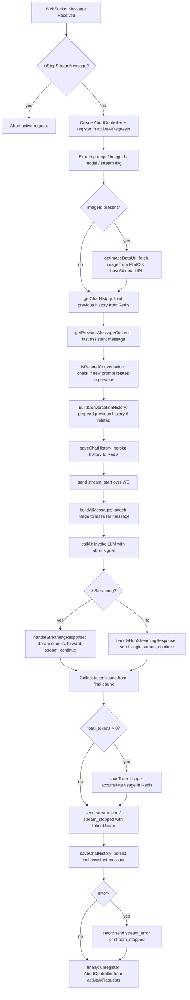
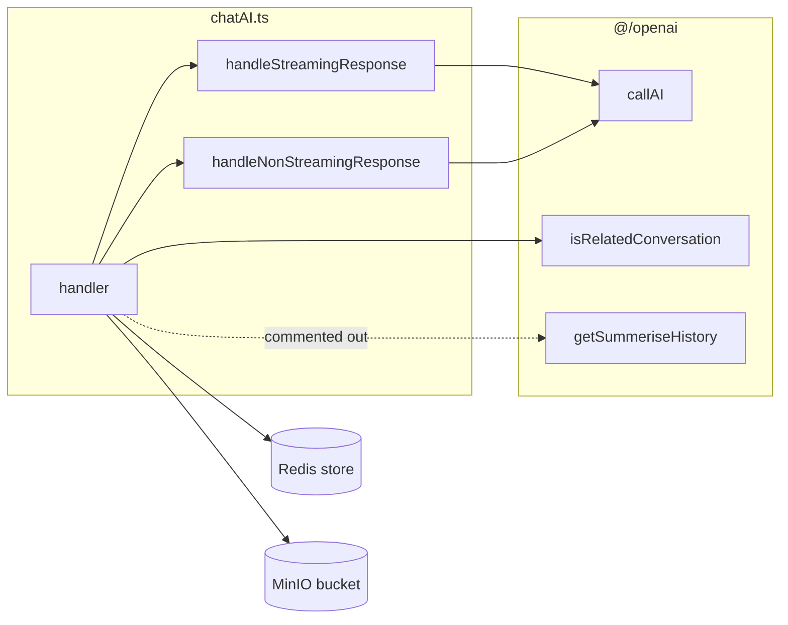

# chatAI.ts — Request Flow Graph

Visual overview of the WebSocket `chatAI` handler.

## Message Flow

## Module Dependency Graph

## Key Functions

| Function | Purpose |
| --- | --- |
| `handler` | Entry point; routes stop/chat requests, orchestrates history, AI call, and token usage. |
| `handleStreamingResponse` | Consumes `AsyncIterable<AIResponseChunk>`, streams `stream_continue` chunks, captures token usage. |
| `handleNonStreamingResponse` | Sends a single `stream_continue` with the full response. |
| `buildConversationHistory` | Prepends previous history when the new prompt is related. |
| `getImageDataUrl` | Resolves an uploaded image id to a base64 data URL via MinIO. |
| `saveTokenUsage` | Accumulates per-session token usage in Redis. |

## WebSocket Message Types Emitted

| Type | When |
| --- | --- |
| `stream_start` | Before the AI call begins. |
| `stream_continue` | Per response chunk (streaming) or once (non-streaming). |
| `stream_end` | Successful completion, includes `tokenUsage`. |
| `stream_stopped` | Request aborted via `stop_stream` or an aborted request. |
| `stream_error` | Handler error, includes `error` message. |
